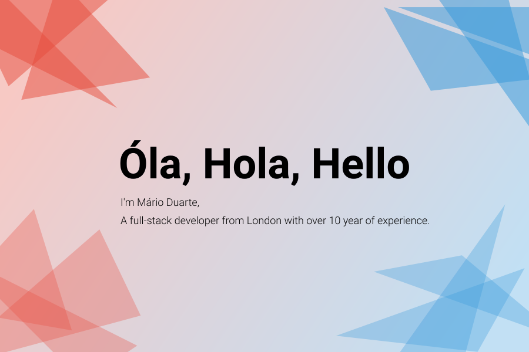

## Óla, Hola, Hello 👋
### I am a Senior developer / Tech Lead  Living in England, United Kingdom.  I â¤ï¸ create 🛠and turn them into 🦋 using JavaScript 🪄!
#### From design to UX to the client browser, love creating high polished solutions every step of the way.
🢠Corrently working at [Tillit invest](https://tillitinvest.com/) as a Senior Software Developer building the next generation in [DYI investment plaftform](https://my.tillitinvest.com/invitation/87RTMSKYG46E) that empowers its users to make better investment decisions.  
🔭 I’m currently working on my next NodeJS/ReactJS project 
🌱 Always expanding my knowledge of Javascript, PHP, Phyton and others 
👯 Always happy to help and mentor others! [Contact me](https://twitter.com/MDesignsuk) to find out more. 
📫 Reach me via [Twitter @MDesignsuk](https://twitter.com/MDesignsuk) 
⚡ Fun fact: Love Photography! [Check it out!](https://www.instagram.com/m.duarte_/) 

Also feel free to check out my Cool doodles on [CodePen](https://codepen.io/MarioDesigns), Have fun! 😄

<!--
**Mario-Duarte/Mario-Duarte** is a ✨ _special_ ✨ repository because its `README.md` (this file) appears on your GitHub profile.

Here are some ideas to get you started:

- 🔭 I’m currently working on ...
- 🌱 I’m currently learning ...
- 👯 I’m looking to collaborate on ...
- 🤔 I’m looking for help with ...
- 💬 Ask me about ...
- 📫 How to reach me: ...
- 😄 Pronouns: ...
- ⚡ Fun fact: ...
-->
